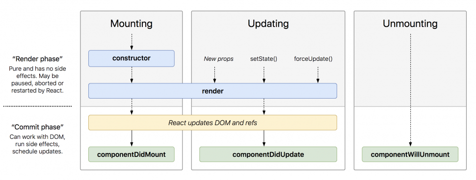

# Ciclo de vida de un componente

# Tabla para entender Lyfecycle

|Métodos de Lifecycle|Hooks de LifeCycle|
| ------------------ | ---------------- |
| Introducido en versiones iniciales | Introducido en 2018 |
| Funciona con ES5 | Funciona con >ES6 |
| Incorporado en componentes de clase | Incorporado para componentes funcionales |
| Necesita de un constructor para inicialziar | No necesita constructor |
| Uso de THIS bindeado de la clase | No necesita THIS para ser usado |


## HOOKS

 

Hooks son funciones que lo que hacen es simplificar o especificar mecanismos para trabajar con componentes funcionales.

mientras que los componentes de tipo clase tenian un estado de tipo privado un contructor 

[Ejemplo1 useState](primerProyect/src/hooks/Ejemplo1.jsx)

[Ejemplo 2  useState useEffect useRef](primerProyect/src/hooks/Ejemplo2.jsx)

Con la introducción de los Hooks en React 16.8, los componentes funcionales ahora pueden manejar su propio estado y efectos, lo que permite realizar las mismas tareas que los componentes basados en clases, pero de una manera un poco diferente. Aquí hay una descripción simplificada de estos hooks:


| Hook          | Descripción |
|---------------|-------------|
| `useState()`  | Es como poner el huevo de la mariposa. Este hook nos permite agregar estado a nuestro componente. |
| `useEffect()` | Es como cuando la mariposa sale del huevo y se convierte en una larva, y luego en una mariposa. Este hook nos permite manejar los efectos secundarios en nuestro componente, que pueden suceder después de que se renderiza (como `componentDidMount` y `componentDidUpdate`) y justo antes de que se elimine de la pantalla (como `componentWillUnmount`). |

Componente de clase:

```jsx
import React, { Component } from 'react'
import PropTypes from 'prop-types'

class LifeCycleExample extends Component {

    static getDerivedStateFromProps(props, state) {
        console.log('getDerivedStateFromProps: Se llama justo antes de renderizar el componente, tanto en el montaje inicial como en las actualizaciones posteriores.');
        return null;  // Devuelve null si no hay cambios en el estado
    }
    
    constructor(props) {
        super(props)
        console.log('CONSTRUCTOR: Cuando se instancia el componente');
    }

    componentDidMount() {
        console.log('DidMount: Justo después del montaje del componente')
    }

    shouldComponentUpdate(nextProps, nextState) {
        /**
         * Controlar si el componente debe o no actualizarse
         */
        // return true / false
    }

    componentDidUpdate(prevProps, prevState) {
        console.log('DidUpdate: Justo después de actualizarse');
    }

    componentWillUnmount() {
        console.log('WillUnmount: Justo antes de desaparecer')
    }

    render() {
        console.log('RENDER: Se llama cuando se monta el componente y cada vez que se actualiza');
        return (
            <div>

            </div>
        )
    }
}

LifeCycleExample.propTypes = {

}

export default LifeCycleExample
```

componente funcional

```jsx

import React, { useState, useEffect, useRef } from 'react'
import PropTypes from 'prop-types'

function LifeCycleExample(props) {
    const [state, setState] = useState(null);
    const mounted = useRef(false);

    console.log('RENDER: Se llama cuando se monta el componente y cada vez que se actualiza');

    useEffect(() => {
        if (!mounted.current) {
            // Esto es equivalente a 'componentDidMount'
            console.log('DidMount: Justo después del montaje del componente');
            mounted.current = true;
        } else {
            // Esto es equivalente a 'componentDidUpdate'
            console.log('DidUpdate: Justo después de actualizarse');
        }

        return () => {
            // Esto es equivalente a 'componentWillUnmount'
            console.log('WillUnmount: Justo antes de desaparecer');
        }
    });

    useEffect(() => {
        // Esto es equivalente a 'getDerivedStateFromProps'
        console.log('getDerivedStateFromProps: Se llama justo antes de renderizar el componente, tanto en el montaje inicial como en las actualizaciones posteriores.');
        setState(props);  // Actualizamos el estado con las nuevas props
    }, [props]);

    return (
        <div>

        </div>
    )
}

LifeCycleExample.propTypes = {

}

export default LifeCycleExample
```


